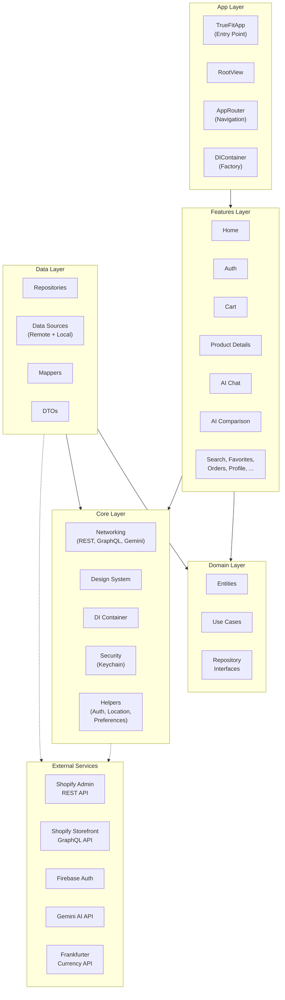

<p align="center">
  <!-- TODO: add app icon here -->
  <h1 align="center">TrueFit</h1>
  <p align="center">AI-powered e-commerce for fashion, built with SwiftUI and Shopify.</p>
</p>

<p align="center">
  
  
  
  
  
</p>

---

TrueFit is a native iOS e-commerce application that connects to a Shopify storefront and augments the shopping experience with Google Gemini AI. Users can browse products, manage a cart via Shopify's Storefront GraphQL API, compare products with AI-generated structured analysis, and chat with an AI fashion assistant — all within a SwiftUI interface built on Clean Architecture principles.

<!-- TODO: add screenshots/GIFs here — Onboarding, Home, Product Details, AI Comparison, Cart, Checkout -->

---

## Table of Contents

- [Key Features](#key-features)
- [Architecture](#architecture)
- [Tech Stack](#tech-stack)
- [Project Structure](#project-structure)
- [Prerequisites](#prerequisites)
- [Setup & Installation](#setup--installation)
- [Configuration](#configuration)
- [Apollo GraphQL Codegen](#apollo-graphql-codegen)
- [Build & Run](#build--run)
- [Running Tests](#running-tests)
- [Troubleshooting](#troubleshooting)
- [Contributing](#contributing)
- [Roadmap](#roadmap)
- [License](#license)
- [Acknowledgments](#acknowledgments)
- [Maintainers](#maintainers)

---

## Key Features

### Shopping Experience

- **Product Catalog** — Browse new arrivals, collections, and brands via Shopify's Admin REST API.
- **Product Details** — View variants, pricing, images, and add to cart.
- **Search** — Filter products by collection, brand, or keyword.
- **Favorites** — Locally persisted wishlist using Core Data.
- **Cart & Checkout** — Full cart lifecycle (add, update, remove, discount codes) via Shopify Storefront GraphQL API, with a checkout flow and payment processing.
- **Order History** — View past orders and detailed order information via GraphQL customer queries.
- **Address Management** — CRUD operations on customer addresses through GraphQL mutations.
- **Currency Conversion** — Real-time exchange rates via the Frankfurter API.
- **Reviews** — Product review interface.

### AI Features

- **AI Product Comparison** — Select 2+ products and receive a structured side-by-side analysis (pros, cons, best-for, overall summary) powered by Gemini, rendered as rich UI cards with graceful fallback to markdown text.
- **AI Chat Assistant** — Conversational shopping assistant using the Google Generative AI Swift SDK (`gemini-2.5-flash`). Constrained by a strict system prompt to fashion and shopping topics only.
- **Follow-Up Questions** — Contextual follow-up Q&A within the comparison view, with structured JSON responses rendered as dedicated cards.

### Auth & Security

- **Dual Authentication** — Firebase Auth for identity + Shopify Customer API for storefront access, with coordinated registration across both systems.
- **Google Sign-In** — Native Google Sign-In integration.
- **Guest Mode** — Browse without authentication; certain features gated behind login.
- **Keychain Storage** — Secure credential management via a dedicated `KeychainManager`.
- **Onboarding Flow** — First-launch onboarding with persistence via `PreferencesManager`.

### Architecture & Code Quality

- **Clean Architecture** — Strict separation into `Core`, `Data`, `Domain`, and `Features` packages.
- **MVVM** — Each feature module follows the Model-View-ViewModel pattern.
- **Manual Dependency Injection** — Centralized `DIContainer` with factory methods for all ViewModels, eliminating tight coupling.
- **Protocol-Oriented** — Repository interfaces, data source protocols, and use case protocols throughout.
- **Custom Design System** — Shared design tokens (`Colors`, `Typography`, `Spacing`, `Radius`, `Shadow`, `Motion`) and reusable components (`TrueFitToast`, `TrueFitAlert`, `TrueFitStepper`).

---

## Architecture

TrueFit follows **Clean Architecture** with a unidirectional data flow. The codebase is organized into four logical packages, each with a clear responsibility boundary:



**Data flow:** `View` → `ViewModel` → `UseCase` → `Repository (protocol)` → `DataSource` → `Network Client` → `External API`

The `Domain` layer has **zero dependencies** on `Data` or `Core`. The `Data` layer implements `Domain`'s repository interfaces, and the `DIContainer` wires everything together at app launch.

---

## Tech Stack

| Category | Technology | Purpose |
|---|---|---|
| **UI** | SwiftUI | Declarative UI framework |
| **Architecture** | Clean Architecture + MVVM | Separation of concerns, testability |
| **Shopify (REST)** | [Alamofire](https://github.com/Alamofire/Alamofire) | Product catalog, auth via Shopify Admin REST API |
| **Shopify (GraphQL)** | [Apollo iOS](https://github.com/apollographql/apollo-ios) `1.x` | Cart, orders, addresses via Storefront GraphQL API |
| **Authentication** | [Firebase iOS SDK](https://github.com/firebase/firebase-ios-sdk) | User identity management |
| **Google Sign-In** | [GoogleSignIn-iOS](https://github.com/google/GoogleSignIn-iOS) | OAuth-based Google authentication |
| **AI (Comparison)** | Gemini REST API | Structured product comparison (direct HTTP) |
| **AI (Chat)** | [Google Generative AI Swift](https://github.com/google/generative-ai-swift) | Conversational AI chat (`gemini-2.5-flash`) |
| **Image Loading** | [SDWebImage](https://github.com/sdwebimage/sdwebimage) | Async image downloading and caching |
| **Local Persistence** | Core Data | Favorites storage |
| **Secure Storage** | Keychain Services | Token and credential storage |
| **Currency** | Frankfurter API | Real-time exchange rate conversion |
| **GraphQL Codegen** | `apollo-ios-cli` | Type-safe Swift code generation from `.graphql` files |

---

## Project Structure

```text
TrueFit/
├── TrueFit/
│   ├── App/
│   │   ├── TrueFitApp.swift              # @main entry point, Firebase init
│   │   ├── RootView.swift                # State-driven root (splash → onboarding → auth → main)
│   │   ├── RootViewModel.swift           # App state machine (AppState enum)
│   │   ├── AppRouter.swift               # Tab-based NavigationPath routing
│   │   ├── AuthFlowView.swift            # Auth navigation flow
│   │   ├── MainAppView.swift             # Tab bar with Home, Favorites, Cart, Profile
│   │   └── GoogleService-Info.plist      # Firebase config (gitignored)
│   │
│   ├── Packages/
│   │   ├── Core/
│   │   │   ├── DI/
│   │   │   │   └── DIContainer.swift     # Central factory for all dependencies
│   │   │   ├── DesignSystem/
│   │   │   │   ├── Foundations/          # Colors, Typography, Spacing, Radius, Shadow, Motion
│   │   │   │   ├── Components/           # TrueFitAlert, TrueFitToast, TrueFitStepper
│   │   │   │   ├── Extensions/           # View/Color extensions
│   │   │   │   └── Resources/            # Asset catalogs
│   │   │   ├── Networking/
│   │   │   │   ├── Shopify/
│   │   │   │   │   ├── REST/             # RESTClient (Alamofire), Endpoint protocol
│   │   │   │   │   ├── GraphQL/          # ApolloManager, .graphql operation files
│   │   │   │   │   └── Shared/           # ShopifyConfig, Constants
│   │   │   │   ├── AI/                   # GeminiService (REST-based, for AI Comparison)
│   │   │   │   ├── Gemini/               # GeminiChatService (SDK-based, for AI Chat)
│   │   │   │   ├── Frankfurter/          # Currency exchange rate endpoint
│   │   │   │   └── Shared/               # GenericHTTPClient
│   │   │   ├── Security/                 # KeychainManager
│   │   │   ├── State/                    # CartState (observable cart count)
│   │   │   ├── Utilities/                # PriceFormatter, CurrencyManager, ViewState, etc.
│   │   │   └── helpers/                  # AuthManager, LocationManager, PreferencesManager
│   │   │
│   │   ├── Data/
│   │   │   ├── Configuration/            # PaymentConfiguration
│   │   │   ├── DataSources/
│   │   │   │   ├── Remote/               # Firebase, Shopify, Google Sign-In, Cart, Orders, Address, AIChat, Currency
│   │   │   │   └── Local/                # FavoritesLocalDataSource (Core Data), PaymentLocalDataSource
│   │   │   ├── DTOs/                     # Data Transfer Objects (Remote/Local/Payment)
│   │   │   ├── Repositories/             # Concrete implementations of Domain protocols
│   │   │   ├── Mappers/                  # GraphQL/REST → Domain entity mappers
│   │   │   └── Gateways/                 # PaymentGatewayProtocol, StubPaymentGateway
│   │   │
│   │   ├── Domain/
│   │   │   ├── Entities/                 # Product, Cart, User, Brand, Collection, CurrencyRates, etc.
│   │   │   ├── UseCases/                 # 27+ use cases (auth, products, cart, favorites, orders, address, payment, AI)
│   │   │   └── RepositoryInterfaces/     # Protocol definitions for all repositories
│   │   │
│   │   └── Features/                     # 19 feature modules, each with View/ + ViewModel/
│   │       ├── AIChat/                   # Conversational AI assistant
│   │       ├── AIComparison/             # Structured product comparison
│   │       ├── Adress/                   # Address management
│   │       ├── AuthFeature/              # Sign In, Sign Up, Forgot Password
│   │       ├── Cart/                     # Cart management
│   │       ├── CompeleteOrder/           # Order completion confirmation
│   │       ├── CurrencyConversion/       # Currency converter
│   │       ├── Favorite/                 # Favorites list
│   │       ├── Home/                     # Home screen (new arrivals, collections, brands)
│   │       ├── Onboarding/               # First-launch walkthrough
│   │       ├── Orders/                   # Order history and details
│   │       ├── Payment/                  # Payment processing
│   │       ├── ProductDetails/           # Product detail view
│   │       ├── ProductList/              # Product listing (by collection, brand, or all)
│   │       ├── Profile/                  # User profile and settings
│   │       ├── Reviews/                  # Product reviews
│   │       ├── Search/                   # Product search and filtering
│   │       ├── Shared/                   # Shared UI components across features
│   │       └── Splash/                   # Launch screen animation
│   │
│   ├── Assets.xcassets/                  # App icons and global assets
│   ├── ContentView.swift                 # Default content view
│   ├── Info.plist                        # Bundle config (Shopify + Gemini keys injected from xcconfig)
│   └── Persistence.swift                 # Core Data stack (PersistenceController)
│
├── ShopifyAPI/                           # Apollo-generated Swift package
│   ├── Package.swift                     # SPM manifest (depends on apollo-ios ApolloAPI)
│   └── Sources/
│       ├── Operations/
│       │   ├── Queries/                  # GetCart, FetchCustomerAddresses, GetCustomerOrders, GetCustomerOrderDetails
│       │   └── Mutations/                # CreateCart, AddCartLines, UpdateCartLines, RemoveCartLines, ApplyDiscountCode, CreateAddress, UpdateAddress, DeleteAddress
│       ├── Fragments/                    # Shared GraphQL fragments
│       └── Schema/                       # Generated schema types
│
├── graphql/
│   └── schema.graphqls                   # Full Shopify Storefront API schema (SDL)
│
├── AIConfig/                             # AI feature documentation
│   ├── Agents.md                         # Agent definitions (ComparisonAgent, FollowUpAgent)
│   ├── design.md                         # AI Comparison feature design document
│   └── Layers/
│       └── Agent.md                      # Detailed agent layer specification
│
├── Config.xcconfig.example               # Template for API keys (tracked in git)
├── Config.xcconfig                       # Actual API keys (gitignored)
├── apollo-codegen-config.json            # Apollo codegen configuration
├── generate_apollo.sh                    # Codegen wrapper script
├── TrueFit.xcodeproj/                    # Xcode project
├── TrueFitTests/                         # Unit test target (scaffold)
└── TrueFitUITests/                       # UI test target (scaffold)
```

---

## Prerequisites

| Requirement | Version |
|---|---|
| **Xcode** | 15.0+ |
| **iOS Deployment Target** | 16.2+ |
| **Swift** | 5.0+ |
| **Shopify Store** | With Storefront API and Admin API access configured |
| **Firebase Project** | iOS app registered, `GoogleService-Info.plist` downloaded |
| **Google Gemini API Key** | From [Google AI Studio](https://aistudio.google.com/) |

---

## Setup & Installation

### 1. Clone the repository

```bash
git clone https://github.com/mohsharafeldin/TrueFit.git
cd TrueFit
```

### 2. Create the configuration file

```bash
cp Config.xcconfig.example Config.xcconfig
```

Edit `Config.xcconfig` with your actual credentials (see [Configuration](#configuration) below).

### 3. Add Firebase configuration

1. Create a Firebase project at [console.firebase.google.com](https://console.firebase.google.com).
2. Register an iOS app with your bundle identifier.
3. Download `GoogleService-Info.plist`.
4. Place it at `TrueFit/App/GoogleService-Info.plist`.

> **Note:** `GoogleService-Info.plist` is gitignored. Each developer must supply their own.

### 4. Open and build

```bash
open TrueFit.xcodeproj
```

Xcode will resolve Swift Package Manager dependencies automatically on first open.

---

## Configuration

All secrets are injected at build time via `Config.xcconfig` → `Info.plist` → `Bundle.main.infoDictionary`. The `.xcconfig` file is gitignored to prevent credential leaks.

<details>
<summary><strong>Environment variable reference</strong></summary>

| Key | Required | Description |
|---|---|---|
| `SHOPIFY_STORE_NAME` | ✅ | Your Shopify store subdomain (e.g., `my-store`) |
| `SHOPIFY_ADMIN_API_TOKEN` | ✅ | Shopify Admin API access token (`shpat_...`) for REST product endpoints |
| `SHOPIFY_STOREFRONT_TOKEN` | ✅ | Shopify Storefront API access token for GraphQL operations |
| `SHOPIFY_API_VERSION` | ✅ | Shopify Admin REST API version (e.g., `2026-01`) |
| `SHOPIFY_GRAPHQL_API_VERSION` | ✅ | Shopify Storefront GraphQL API version (e.g., `2024-10`) |
| `GEMINI_API_KEY` | ✅ | Google Gemini API key for AI Chat and AI Comparison features |

</details>

**Example `Config.xcconfig`:**

```xcconfig
SHOPIFY_STORE_NAME = your-store-name
SHOPIFY_ADMIN_API_TOKEN = shpat_xxxxxxxxxxxxx
SHOPIFY_STOREFRONT_TOKEN = shpat_xxxxxxxxxxxxx
SHOPIFY_API_VERSION = 2024-10
SHOPIFY_GRAPHQL_API_VERSION = 2024-10
GEMINI_API_KEY = YOUR_API_KEY_HERE
```

---

## Apollo GraphQL Codegen

The `ShopifyAPI/` package contains auto-generated Swift types from the Shopify Storefront GraphQL schema. The GraphQL operations are defined in `.graphql` files at:

```
TrueFit/Packages/Core/Networking/Shopify/GraphQL/Operations/
├── Cart.graphql       # Cart queries/mutations (GetCart, CreateCart, AddCartLines, etc.)
├── Orders.graphql     # Order queries (GetCustomerOrdersList, GetCustomerOrderDetails)
└── Address.graphql    # Address CRUD mutations and fetch query
```

### Regenerating types

If you modify `.graphql` files or need to update the schema, run:

```bash
chmod +x generate_apollo.sh
./generate_apollo.sh
```

This script:
1. Temporarily hides the Xcode `Package.resolved` to avoid Apollo CLI v1 / v3 format conflicts.
2. Runs `./apollo-ios-cli generate` using the config in `apollo-codegen-config.json`.
3. Restores the `Package.resolved`.

### Downloading a fresh schema

The `apollo-codegen-config.json` includes a `schemaDownloadConfiguration` that points to the Shopify Storefront introspection endpoint. To re-download:

```bash
./apollo-ios-cli fetch-schema
```

---

## Build & Run

1. Open `TrueFit.xcodeproj` in Xcode.
2. Ensure the **TrueFit** scheme is selected.
3. Select a simulator or connected device (iOS 16.2+).
4. Press **⌘R** to build and run.

---

## Running Tests

The project includes `TrueFitTests` (unit) and `TrueFitUITests` (UI) targets using XCTest:

```bash
# Run unit tests
xcodebuild test -project TrueFit.xcodeproj -scheme TrueFit -destination 'platform=iOS Simulator,name=iPhone 16'

# Run UI tests
xcodebuild test -project TrueFit.xcodeproj -scheme TrueFit -destination 'platform=iOS Simulator,name=iPhone 16' -only-testing:TrueFitUITests
```

> **Note:** The test targets currently contain scaffold/boilerplate tests. Contributions adding meaningful test coverage are welcome.

---

## Troubleshooting

<details>
<summary><strong>Apollo codegen fails with "Package.resolve file version unsupported!"</strong></summary>

This happens because Apollo CLI v1.0.7 doesn't support Xcode's newer Package.resolved v3 format. Use the provided `generate_apollo.sh` script instead of calling `apollo-ios-cli generate` directly — it temporarily hides the problematic file.

</details>

<details>
<summary><strong>Build error: "GeminiAPIKey is not set in Config.xcconfig"</strong></summary>

The app crashes at launch if the Gemini API key is missing or set to the placeholder value. Ensure `Config.xcconfig` exists (not just the `.example`) and contains a valid `GEMINI_API_KEY`.

</details>

<details>
<summary><strong>Firebase crash at launch: "Could not locate configuration file: 'GoogleService-Info.plist'"</strong></summary>

`GoogleService-Info.plist` is gitignored. Download it from your Firebase Console and place it at `TrueFit/App/GoogleService-Info.plist`. Ensure it's added to the Xcode project target.

</details>

<details>
<summary><strong>GraphQL schema mismatch errors after Shopify API version update</strong></summary>

If Shopify's API schema has changed:
1. Update `SHOPIFY_GRAPHQL_API_VERSION` in `Config.xcconfig`.
2. Update the `endpointURL` version in `apollo-codegen-config.json`.
3. Re-download the schema: `./apollo-ios-cli fetch-schema`
4. Regenerate types: `./generate_apollo.sh`

</details>

<details>
<summary><strong>Google Sign-In fails or redirects don't work</strong></summary>

Ensure the URL scheme in `Info.plist` under `CFBundleURLSchemes` matches your Google OAuth client ID (reversed). The current value is tied to the project's Firebase/Google Cloud configuration.

</details>

---

## Contributing

Contributions are welcome. Please follow these guidelines:

1. **Fork** the repository and create a feature branch:
   ```bash
   git checkout -b feature/your-feature-name
   ```
2. **Follow the existing architecture.** New features should live in `Packages/Features/` with their own `View/` and `ViewModel/` subdirectories. Business logic belongs in `Domain/UseCases/`, data access in `Data/`.
3. **Wire dependencies** through `DIContainer.swift` using lazy properties and factory methods.
4. **Commit** with clear, descriptive messages.
5. **Open a Pull Request** against `develop` with a description of what changed and why.

> No SwiftLint or SwiftFormat configuration is currently enforced. Follow the existing code style for consistency.

---

## Roadmap

- [ ] Add comprehensive unit tests for Use Cases and ViewModels
- [ ] Add UI snapshot tests
- [ ] Implement offline support with Apollo normalized cache
- [ ] Add push notifications for order status updates
- [ ] Integrate Apple Pay as a real payment gateway (currently uses `StubPaymentGateway`)
- [ ] CI/CD pipeline (GitHub Actions for build, test, lint)
- [ ] SwiftLint/SwiftFormat configuration
- [ ] Localization (multi-language support)

---

## License

This project does not currently include a `LICENSE` file. All rights are reserved by the authors until a license is explicitly added.

<!-- TODO: Add a LICENSE file to the repository root (e.g., MIT, Apache 2.0) -->

---

## Acknowledgments

- **[Shopify](https://shopify.dev/)** — Storefront and Admin APIs powering the e-commerce backend.
- **[Google Gemini](https://ai.google.dev/)** — Generative AI powering the chat assistant and product comparison features.
- **[Firebase](https://firebase.google.com/)** — Authentication infrastructure.
- **[Apollo iOS](https://github.com/apollographql/apollo-ios)** — Type-safe GraphQL client for Swift.
- **[Alamofire](https://github.com/Alamofire/Alamofire)** — HTTP networking library.
- **[SDWebImage](https://github.com/sdwebimage/sdwebimage)** — Async image loading and caching.
- **[Frankfurter](https://www.frankfurter.app/)** — Open-source currency exchange rate API.

---

## Maintainers

<!-- TODO: Add maintainer info -->

| Name | Role | Contact |
|---|---|---|
| Mona Zarea | Developer | — |
| Mohamed Sharaf | Developer | — |
| Omar Khaled Jaafar | Developer | — |
| Andrew Magdy | Developer | — |

---

<p align="center">
  Built with ❤️ using SwiftUI
</p>
